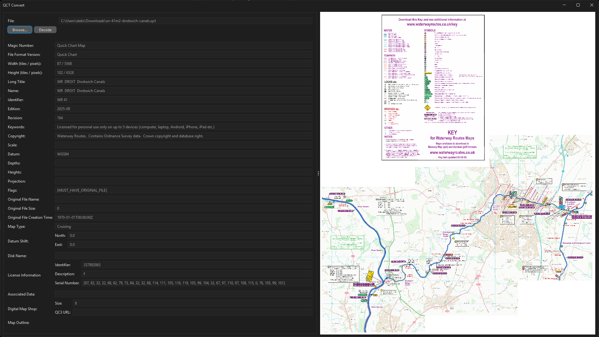

# QCT Convert

> A Java implementation of the [(unofficial) Quick Chart (.QCT)
> File Format Specification (v1.03)](https://www.etheus.net/Quick_Chart_File_Format) offering decoding of `.qct` map
> files
> and export to various formats

## Motivation

This project was inspired by the desire to convert a few of [Ordnance Survey](https://www.ordnancesurvey.co.uk/) UK maps
that I have from the proprietary `.qct` format into more widely accessible formats for use in image viewers and GIS
software. It provides an efficient Java implementation of
the [(unofficial) Quick Chart (.QCT) File Format Specification (v1.03)](https://www.etheus.net/Quick_Chart_File_Format)
by *Craig Shelley* with a Graphical User Interface (GUI).

*A small sample of a `.png` file exported from a `.qct` file, depicting the famous Ben Nevis, the highest point in the
UK. All rights reserved by Ordnance Survey.*

*GUI of the QCT Convert tool. All rights reserved by Waterway Routes.*

## Features

- **QCT File Decoding**
    - [x] Efficient multithreaded decoding
    - [x] Decoding of [Huffman-Coded](http://en.wikipedia.org/wiki/Huffman_coding) tiles
    - [x] Decoding of [Run-Length-Encoded (RLE)](http://en.wikipedia.org/wiki/Run-length_encoding) tiles
    - [ ] Decoding of *Pixel-Packed* tiles
        - *Note:* Not implemented, as I have yet to I have yet to come across any `.qct` file with _Pixel-Packed_ tiles.
          Feel free to open an issue with a sample `.qct` file for implementation and testing purposes.
- **Other**
    - [x] Graphical User Interface
    - [ ] QCT3-file decoding
        - *Note:* QCT3 files are not supported, as they may include encrypted data for Digital Rights Management (DRM).
          I may add support for these in the future, for the unencrypted portion that is.

##### Acknowledgements

This project would not be possible without the incredible work of Craig Shelley and Mark Bryant on
the [(unofficial) Quick Chart (.QCT) File Format Specification v1.03](https://www.etheus.net/Quick_Chart_File_Format).
